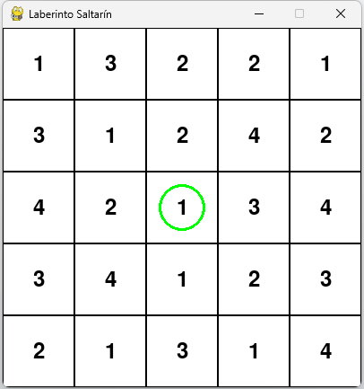

# Proyecto: Laberinto Saltarín
### Daniel López - 2019900871

## Introducción
Este proyecto implementa una solución al problema del laberinto saltarín, donde un agente debe encontrar el camino más corto desde un punto de inicio hasta un destino, moviéndose una cantidad fija de pasos definida por el valor de la celda en la que se encuentra.
## Objetivo
El objetivo de este proyecto es implementar dos algoritmos de búsqueda (DFS y Búsqueda de Costo Uniforme) para encontrar el camino más corto en un laberinto saltarín y comparar su eficacia y eficiencia en diferentes laberintos.


## Estructura del Proyecto Laberinto Saltarín

```
LaberintoSaltarin/
├── data/  # Archivos de entrada con laberintos
│   ├── entrada.txt 
│   ├── entrada2.txt
│   └── entrada3.txt
└── src/
    ├── agent.py # Clase que representa al agente
    ├── game.py  # Clase que representa el juego
    ├── main.py  # Punto de entrada del programa
    ├── maze.py  # Clase que representa el laberinto
    ├── parseador.py # Clase que se encarga de parsear el archivo de entrada
    └── __pycache__/
├── .gitignore
├── README.md
└── Tarea 1 2024.pdf
```


## Instrucciones de Ejecución

1. Ejecuta el archivo `main.py` usando Python desde tu terminal con el siguiente comando:

```bash
python main.py
```

<div style="margin-top:300px;"></div>

## Descripción de los Algoritmos

### Búsqueda en Profundidad (DFS)
- **Funcionamiento**: DFS explora el laberinto de manera exhaustiva, retrocediendo solo cuando se encuentra con un callejón sin salida.
- **Adecuación**: Aunque no garantiza encontrar el camino más corto, DFS es útil en laberintos sin caminos largos o donde el factor de ramificación es bajo.

```python
    def dfs(self):
        stack = [(self.position, [self.position])]  # Pila de posiciones y caminos
        visited = set()  # Conjunto de posiciones visitadas
        visited.add(self.position)  # Añadir la posición inicial a visitados

        while stack:
            current_position, path = stack.pop()  # Obtener la posición actual y el camino actual
            if current_position == self.goal:  # Si se llega a la meta
                self.path = path  # Guardar el camino
                return path

            neighbors = self.maze.find_neighbors(current_position)  # Encontrar vecinos de la posición actual
            for new_position in neighbors:  # Para cada vecino
                if new_position not in visited:  # Si no ha sido visitado
                    visited.add(new_position)  # Añadir a visitados
                    stack.append((new_position, path + [new_position]))  # Añadir a la pila con el nuevo camino

        print("No se encontró solución")  # Si no se encuentra solución
        return None
```

<div style="margin-top:400px;"></div>

### Búsqueda de Costo Uniforme
- **Funcionamiento**: Este algoritmo explora los caminos de menor costo primero, asegurando que el primer camino que llega a la meta es el más corto.
- **Adecuación**: Es efectivo para garantizar la solución más óptima en términos de número de pasos, ya que todos los movimientos tienen el mismo costo.

```python
    def uniform_cost_search(self):
        queue = [(0, self.position, [self.position])]  # Cola de prioridad con tuplas (costo, posición, camino)
        visited = set()  # Conjunto de posiciones visitadas
        visited.add(self.position)  # Añadir la posición inicial a visitados
        while queue:
            cost, current_position, path = heapq.heappop(queue)  # Obtener el costo, posición actual y camino actual de la tupla con menor costo

            if current_position == self.goal:  # Si se llega a la meta
                self.path = path  # Guardar el camino
                return path

            neighbors = self.maze.find_neighbors(current_position)  # Encontrar vecinos de la posición actual
            for new_position in neighbors:  # Para cada vecino
                if new_position not in visited:  # Si no ha sido visitado
                    visited.add(new_position)  # Añadir a visitados
                    new_cost = cost + 1  # Costo uniforme de cada paso
                    heapq.heappush(queue, (new_cost, new_position, path + [new_position]))  # Añadir a la cola con el nuevo costo y camino
        return None
```


## Desafíos y Soluciones
- **Coordenadas**: Uno de los mayores desafíos fue manejar correctamente las coordenadas (x, y) en todas las operaciones. Ya que Pygame utiliza un sistema de coordenadas diferente al de una matriz, esto causó problemas en la visualización del laberinto.
- **Solución**: Se aseguro que todas las funciones respetaran un sistema de coordenadas consistente, pasando siempre coordenadas como (y, x) excepto en las operaciones de dibujo.

<div style="margin-top:300px;"></div>

## Ejemplos de Entradas y Salidas


### Ejemplo 1: Laberinto Pequeño

**Entrada** (`entrada.txt`):
```
5 5 0 0 4 4
2 3 1 2 1
1 2 3 3 2
2 1 4 3 3
3 3 1 1 2
1 2 2 2 3
```

**Salida**:
```
Meta alcanzada en 4 movimientos
```

**Descripción**:
El laberinto es de tamaño 5x5 con el punto de inicio en (0,0) y el punto de destino en (4,4). El algoritmo encuentra un camino que alcanza la meta en 4 movimientos.

### Ejemplo 2: Caminos Bloqueados

**Entrada**:
```
4 4 1 1 3 3
3 1 2 4
4 3 1 3
2 1 3 2
1 2 2 4
```

**Salida**:
```
No se encontró solución
```

**Descripción**:
Un laberinto de 4x4 con inicio en (1,1) y destino en (3,3). Todos los caminos están bloqueados, impidiendo que el algoritmo encuentre una ruta válida.

<div style="margin-top:200px;"></div>

### Ejemplo 3: Objetivo Inaccesible

**Entrada**:
```
3 3 0 0 2 2
1 4 3
2 1 2
3 4 1
```

**Salida**:
```
No se encontró solución
```

**Descripción**:
En este laberinto de 3x3, aunque parece haber caminos disponibles, la configuración de los saltos impide alcanzar la meta desde el punto de inicio (0,0) al destino (2,2).

### Ejemplo 4: Laberinto Grande

**Entrada**:
```
6 6 2 2 5 5
1 3 2 2 1 4
3 1 2 4 2 3
4 2 1 3 4 1
3 4 1 2 3 2
2 1 3 1 4 3
1 2 3 2 1 4
```

**Salida**:
```
Meta alcanzada en 3 movimientos
```

**Descripción**:
En un laberinto más grande de 6x6, con el inicio en (2,2) y el destino en (5,5). El algoritmo de búsqueda logra encontrar un camino eficiente que alcanza la meta en solo 3 movimientos.




## Análisis de Rendimiento
- **DFS**: Rápido en laberintos pequeños pero ineficiente en laberintos grandes debido a su naturaleza exhaustiva.
  
- **Búsqueda de Costo Uniforme**: Más lento pero garantiza encontrar el camino más corto, ideal para laberintos donde cada paso tiene el mismo costo.


## Conclusión
Este proyecto demostró la eficacia de diferentes algoritmos de búsqueda en el contexto de un laberinto saltarín y  cómo la elección del algoritmo puede afectar la eficiencia y eficacia de la solución.

## Apéndices
- [Código fuente](https://github.com/Primo18/tarea1-IA-UdeC/tree/main)


